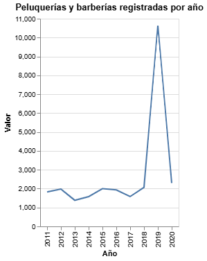

# Barberías bajo sospecha
 
 El negocio de las peluquerías y sobretodo, el de las barberías, ha visto su credibilidad en entredicho a causa de un llamativo aumento en las empresas que enmarcan su actividad económica en el apartado de peluquerías y y otros tratamientos de belleza.

Si bien durante los primeros años de la década de 2010’ existió un aumento en las empresas registradas como “peluquerías y otros tratamientos de belleza”.  En 2018, las barberías marcaron su mayor salto en términos porcentuales, con un crecimiento del 44,7%. Y aunque en la pandemia la cifra cayó, en 2021 tuvieron una rápida recuperación, con 14.500 empresas inscritas bajo este rótulo comercial.

Desde 2020, inicio de la pandemia, a 2022 se crearon 3.368 empresas con giro de peluquería y otros tratamientos de belleza. Un robusto crecimiento de 29% en solo dos años. Otros datos llamativos son el número de trabajadores de estos negocios. En 2020 habían 11.586 locales registrados, con 6.070 personas trabajando de forma dependiente en ellas; en 2021, éstas llegaban a 14.627 y los trabajadores sumaban 8.097; pero en 2022, las empresas llegan a casi 15 mil y la cifra de empleados bajó a 7.180.

Algo que suscita extrañeza, es que en 2020 habían 11.586 locales registrados, con 6.070 personas trabajando de forma dependiente en ellas; en 2021, éstas llegaban a 14.627 y los trabajadores sumaban 8.097; pero en 2022, las empresas llegan a casi 15 mil y la cifra de empleados bajó a 7.180. 

Esto, sumado a múltiples denuncias e investigaciones en torno a este tipo de empresas, ha llevado a que autoridades como Sergio Morales, coordinador del Observatorio del Comercio Ilícito y Seguridad de la CNC, señala que el fenómeno de las barberías "ha ido en aumento en los últimos años", y que , "después de muchos operativos policiales, se ha detectado que en ciertos lugares esta industria tiene algunos vínculos con bandas delictuales, como ocurre en otros países de Latinoamérica".En la misma línea,  la actual Contralora General de la República, reconociera que podría tratarse de un mecanismo vinculado al lavado de activos. Dicha autoridad señaló: “Todos los chilenos sabemos qué es lo que pasa con estas barberías(...) y si gente tiene un capital propio gigantesco, gente que no se sabe de dónde sacó ese capital ¿No será lavado de activos?” 

Según el Ministerio Público, en 2022 hubo 164 casos ingresados por lavado de dinero, los que subieron a 210 en 2023. Durante 2022, en tanto, la fiscalía reportó 116 sentencias definitivas condenatorias y 122 el año siguiente, por ese ilícito.

### Aquí va una imagen

Tal como mencionamos,existió un gran aumento de peluquerías que se vio frenado por la pandemia, pero que luego recuperará y superará dichos números.

